# **Form Validations**

React practice with forms and validations.
using [Form Submit](https://formsubmit.co/) as backend platform in order to send the email.

 > **demo [here](https://form-validations-fawn.vercel.app/)**
## **Project structure**

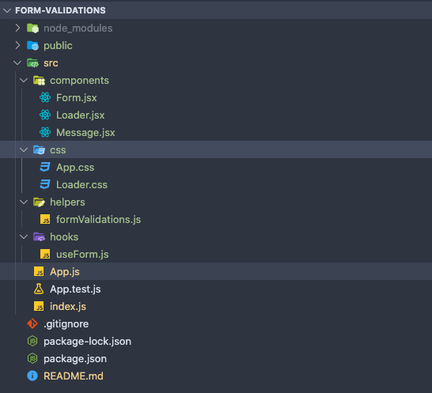

### **RegEx validations:**
``helpers > formValidations.js``
- name input: can't be empty and numbers are not allowed.
- email: should be a valid email
- subject: can't be empty
- comments/contact message: can't be empty and must not have more than 255 characters

### **custom hooks**
`hooks > useForm.js`

useForm receive `initialForm` as parameter and return and object with:
  - form data. 
  - loader value (true or false) in order to render Loader component
  - error object in case of fails validations
  - response value (true or false) in order to render Message component with success text or alert in case of errors
  - handleChange: listen for changes on inputs and grab the values
  - handleBlur: use setError state and pass the formValidations functions to start validating all the inputs
  - handleSubmit: fetch url from form submit, and pass the form info, reset loader and response states as needed

state: 
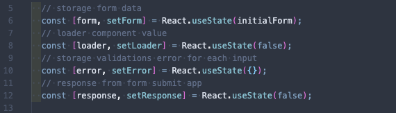
  - form: storage form data
  - loader: can be true or false, conditional rendering for Loader component on sending message
  - error: setError will receive the validation function from helpers folder, then run validations for each field, is some fails it will create an object that will storage the input name with corresponding error message 
  - response: can be true and false, starting at false and after fetch submit form it will return the promise with response, response will change to true and display success message via Message component.

  Global variables:  

  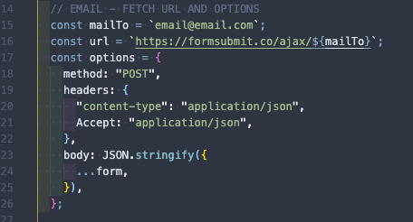

  - mailTo: need to be changed from email@email.com to the email when you want to receive the form information
  - url: don't need to be edited, is pointed to the form submit services using template strings in order to add the email assigned to `mailTo` variable  

## **screenshots**

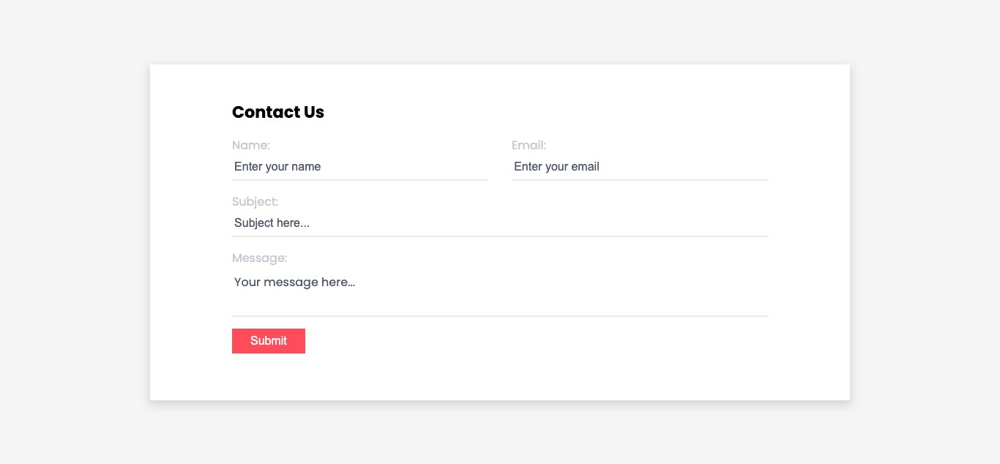
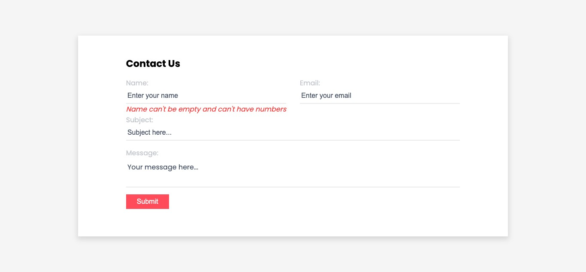
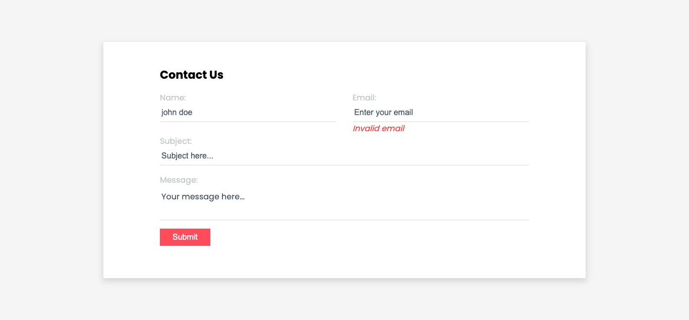
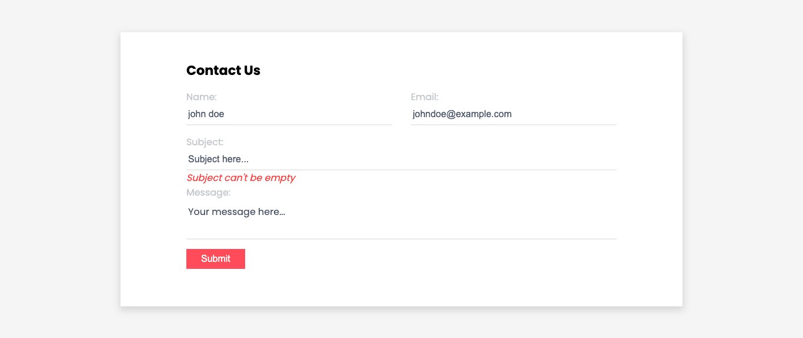
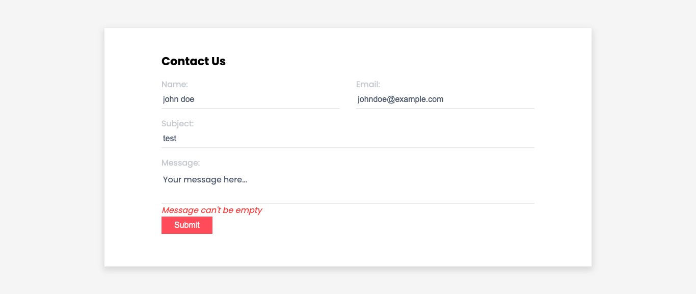
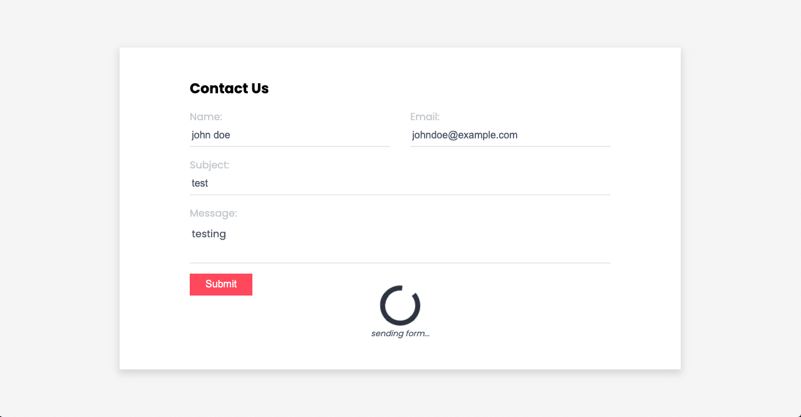
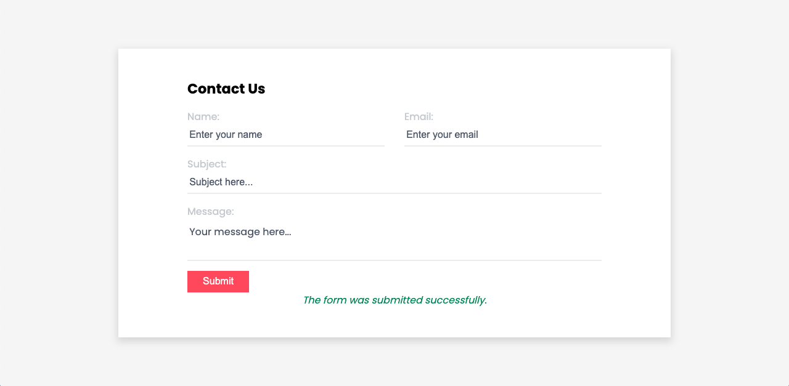
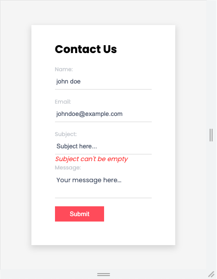